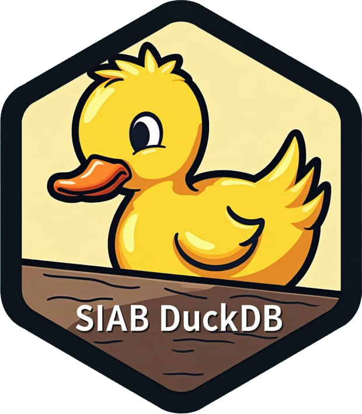

# SIAB  DuckDB 


## Project Overview

This project is a reimplementation of the data preparation process for the Sample of Integrated Labour Market Biographies (SIAB) in modern data science languages using `DuckDB`. It is based on the original `STATA` reference implementation by [Wolfgang Dauth and Johann Eppelsheimer (2023)](https://labourmarketresearch.springeropen.com/articles/10.1186/s12651-023-00335-w). It handles large datasets very efficiently and can even work when data exceeds available memory, because neither arm has to hold the whole dataset: the R arm leaves it in `DuckDB`, and the Python arm streams it through `polars` from one Parquet file to the next.

The preparation exists twice here, as two arms, each written for a big-data engine so that the SIAB never has to fit in memory. The **R arm** is tidyverse code: `dplyr` and `dbplyr` translate every step into SQL that DuckDB runs, and the same code would run on another engine `dbplyr` writes for. The **Python arm** is `polars`: the steps are polars expressions, and the table between two steps is kept either in a DuckDB database or in a plain folder of Parquet files, whichever you point it at. Both carry the same eighteen steps under the same function names, and both are tested column by column against outputs from the original STATA reference on the IAB testdata. You can pick whichever language you work in, the two pipelines work the same.

How close is close: every column the reference computes deterministically is completely identical to it, the columns STATA stores as four-byte floats agree to about seven digits, and the imputed wages, where each implementation draws values at random from the estimated distribution, match the reference's mean and quartiles to within one percent.

### What DuckDB does here

DuckDB is the database the prep lives in: the read-in writes the SIAB into it, every step reads a table out of it and writes one back, and what you hold at the end is a database you can query in SQL from STATA, R or Python.

- In the **R arm** DuckDB is the engine. `dbplyr` turns each step into SQL and DuckDB executes it, so the database does the work. Only the episode splitting is written as SQL by hand.
- In the **Python arm** DuckDB is storage. The eighteen steps hold no SQL at all and compute in `polars`, episode splitting included, so the store only has to hand a table over and take one back. A DuckDB database does that, and so does a folder with one Parquet file per table, which is what `main.py` uses when you point it at a folder instead of a `.duckdb` file. Nothing in the Python prep needs a database engine.

### Which SIAB version this targets

The target is the **SIAB 7523 v2**, the weakly anonymous extract covering 1975 to 2023.

### Advantages of Using DuckDB

- **High Performance**: DuckDB's in-memory database engine optimizes query performance, significantly speeding up the preparation compared to STATA. In addition processes like wage imputation based on observables are also much faster in R, leading to run times of less than 40 minutes for the entire workflow on a very limited virtual machine with just 8GB of RAM. That figure is a measurement of the R arm. The Python arm has not been timed on a full delivery.
  
- **Big Data Capability**: This implementation can handle datasets that exceed memory limits, making it possible to extend this code to prepare the entire universe of German social security data with only minor modifications. This larger-than-memory capability was tested by running the R arm on a virtual machine with artificially limited memory to a size smaller than the SIAB 2% sample data. The Python arm earns the same property wherever a step's table is handed over as a file: `polars` scans the file and `sink_parquet()` streams the result back into one, so neither side of a boundary holds the dataset. A Parquet store always works this way, and a `.duckdb` store does when it is opened for it, which is the `SIAB_BOUNDARY` setting described under Getting started.

- **Portability**: The use of `dbplyr` and automatic SQL translation to DuckDB ensures that most of the R code is a pure tidyverse implementation, and only the episode splitting part uses SQL code directly. It can therefore be adapted to another database system, or to a different big-data back end such as [tidypolars](https://github.com/etiennebacher/tidypolars), by changing where the tables live. The Python arm goes the same way from the other side: the steps are `polars` and carry no SQL, so DuckDB is one storage choice there and plain Parquet files are the other.

## Repository layout

```
SIAB_DuckDB/
  R/                  the R arm: siab_main.R, run_testdata.R,
                      stata_to_db_batch_read.R and functions/
  python/             the Python arm: the siab package and main.py
  classifications/    shared, language-neutral lookup tables (CSV)
  tests/              testthat/ for R, pytest/ for Python,
                      and the shared Stata fixtures
  benchmark/          a synthetic delivery of any size, and the harness
                      that times all three arms over it
  log/                per-step run logs, written by either arm
```

Both arms answer to the same Stata reference and to the same committed fixtures.
Neither answers to the other.

## Installation and Setup

### Prerequisites

Install the arm you intend to run. Nothing in the R arm needs Python, and nothing in the Python arm needs R.

#### The R arm

- **R**: Ensure that R is installed on your machine.
- **DuckDB**: Install the DuckDB package for R.
- **tidyverse**: The code relies on `dplyr`, `dbplyr`, `readr`, `tidyr`, `purrr`, `stringr`, `glue` and `here`.
- **logger**: Logger writes the log files of the preparation workflow.
- **survival**: Contains the fast censored normal regression used for imputing wages on observables.
- **readstata13**: Reads the Basic Establishment File for the BHP merge.
- **scales** and **data.table**: `scales` labels the censoring overviews in the imputation, `data.table` is used by the read-in step.

#### The Python arm

- **Python 3.11** or newer, and [uv](https://docs.astral.sh/uv/) to resolve the environment. `uv run --project python` installs everything below on first use from `python/pyproject.toml`.
- **polars**: holds all eighteen steps. **pyarrow** writes and reads the Parquet files the steps hand over through.
- **duckdb**: the default store, what the R arm reads, and since 2026-09-21 what the wage imputation works in whatever the store: that step sorts the dataset, reads one cell at a time and takes leave-one-out means as ordered windows, none of which a polars plan runs out of core. A Parquet store still keeps its own tables as files and hands them over as files, and the store layer imports DuckDB only when a `.duckdb` store is opened.
- **numpy** and **scipy**: `scipy.optimize` maximises the censored normal likelihood used for imputing wages on observables, which is what `survival::survreg()` does in the R arm.
- **pyreadstat** and **pandas**: `pyreadstat` reads the STATA delivery and the Basic Establishment File, and returns a `pandas` frame.

### Getting started

1. **Clone the repository**:
   ```bash
   git clone https://github.com/edubruell/SIAB_DuckDB.git
   ```

2. **Read a SIAB into the store**
`R/stata_to_db_batch_read.R` contains all code needed to install the prerequisites and read a STATA SIAB 7523 v2 file into a duckdb database. `python/stata_to_db_batch_read.py` is its counterpart in the Python arm. Both read the delivery in batches of whole persons and write the same `orig` table, so either read-in can feed either pipeline. Both take two environment variables, `SIAB_RAW_FOLDER` for the folder the delivery sits in and `SIAB_DB_FOLDER` for the folder the database is written to. Run one of them to get started.

The Python read-in also takes `SIAB_DB`, the store itself, which is what chooses between the two. A name ending in `.duckdb` is a database; any other name is a folder that will hold one Parquet file per table.

   ```bash
   Rscript R/stata_to_db_batch_read.R
   uv run --project python python python/stata_to_db_batch_read.py
   ```

3. **Data preparation workflow**
`R/siab_main.R` launches the preparation workflow in the R arm, `python/main.py` in the Python arm. The two run the same steps in the same order and build the same panel, up to the random draw in the wage imputation, which each arm takes from its own generator.

   ```bash
   Rscript R/siab_main.R
   uv run --project python python python/main.py
   ```

The Python pipeline reads the same `SIAB_DB` and falls back to `SIAB_DB_FOLDER/siab.duckdb`, so the read-in and the pipeline are pointed at one place:

   ```bash
   SIAB_DB=/somewhere/siab.duckdb  uv run --project python python python/main.py   # a DuckDB database
   SIAB_DB=/somewhere/siab_store   uv run --project python python python/main.py   # a folder of Parquet files
   ```

It also reads `SIAB_RAW` for the delivery folder, falling back to `SIAB_RAW_FOLDER`, and `SIAB_LOG` for the log folder. Two more govern how a `.duckdb` store hands a table between steps: `SIAB_BOUNDARY`, which is `memory` by default and `parquet` for the larger-than-memory case, and `SIAB_SPILL`, which moves the handover files `parquet` writes, beside the database by default. A Parquet store hands its tables over as files in any case and ignores both.

The R script installs and loads the necessary packages with the `pacman` package manager and its `p_load()` function. It then connects to a duckdb database, keeps the employment history, generates the year and age variables, and runs the following steps from the `R/functions` folder.

- `drop_empty_columns()`: Drops every column that is missing on all rows, as the reference master does once the sources are restricted. Pass `drop = FALSE` to keep them.
- `split_episodes()`: Splits the episodes in the SIAB data.
- `reallocate_one_time_payments()`: Moves one-time payments onto the episodes they belong to.
- `generate_biographic_variables()`: Generates biographical variables.
- `restrict_observation_period()`: Keeps the episodes whose year lies in the observation period, 1975 to 2023 by default.
- `generate_occupation_variables()`: Generates occupation-related variables.
- `generate_educ_variable()`: Generates the education variable.
- `merge_basic_bhp()`: Merges the Basic Establishment File.
- `generate_industry_variables()`: Maps the three-digit industry to the two one-digit classifications.
- `generate_limit_assess()`: Generates the wage assessment ceiling variable.
- `generate_limit_marginal()`: Generates the marginal wages related variables.
- `deflate_wages()`: Deflates the wages using the CPI.
- `impute_wages()`: Imputes missing wages.
- `handle_parallel_episodes()`: Handles parallel episodes.
- `build_yearly_panel()`: Builds the yearly panel.

`build_monthly_panel()` is an alternative to the last step rather than a step after it: it cuts every episode into one row per calendar month and keeps the month's 15th, where the yearly panel keeps one episode per year. Both start from the output of `handle_parallel_episodes()`, so a pipeline calls one or the other. The call sits commented out in `R/siab_main.R`, next to the yearly one.

Two further merges, `merge_annual_bhp()` and `merge_akm()`, sit commented out in `R/siab_main.R`. Both read files that have to be requested from the FDZ on top of the SIAB itself. Uncomment either call once the files are in place.

The Python arm carries every one of these steps under the same name, one module per step in `python/siab/steps/`, numbered as the R and STATA files are with an `s` in front because a Python module name cannot start with a digit. `python/main.py` calls them in the same order, with the same two merges and the same monthly panel commented out.

Each of these steps logs its progress to the specified log files.

4. **Run the tests**
Both suites run without STATA and without the SIAB itself, on synthetic data built in the tests. The comparisons against the committed STATA fixtures skip when a dump is absent.

   ```bash
   Rscript tests/testthat.R
   uv run --project python python -m pytest tests/pytest
   ```

### Acknowledgments

This project builds on the methodology outlined by Wolfgang Dauth and Johann Eppelsheimer. The original STATA scripts provided in their supplementary materials were essential references for this reimplementation.

### Licence
This project is licensed under the Creative Commons Attribution 4.0 International License (CC BY 4.0). See the LICENSE file for details.
